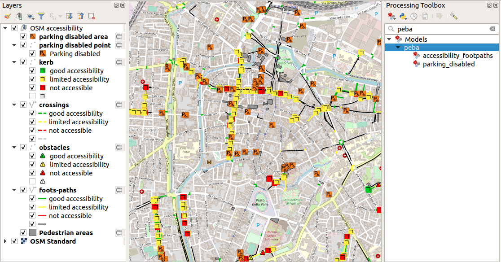

# PEBAmap

Tools to create a map of urban accessibility using OpenStreetMap data and QGIS.

## Objective

The purpuse is to provide users with a workflow to:
* query and extract from OpenstreetMap features related to footpaths;
* apply some algorithms to classify features in relation to accessibility for disabled people;
* apply symbols and styles;
* create a map of urban accessibility.

## Content of the repository

This repository contains:
* one QGIS project ([OSMaccessibility.qgz](OSMaccessibility.qgz)) to be used to test the tools
* 2 QGIS processing models to extract and style elements related to footpaths ([accessibility_footpaths.model3](accessibility_footpaths.model3)) and parking spaces for disable people ([parking_disabled.model3](parking_disabled.model3)).
* a folder ([styles](styles)) containing some .qml files and a few symbols for styiling features in QGIS.

## QGIS processing modules

[...]

## Background information

During 2019, the local administration of [Padua](https://en.wikipedia.org/wiki/Padua) promoted and funded a work to the release of the local PEBA - Plan for the Elimination of Architectural Barriers (_Piano per l'Eliminazione delle Barriere Architettoniche_ in italian), with the aim to improve the accessibility of urban spaces (footpaths, sidewalks, ...) and public buildings to all people, with a special focus to disabled people.

## Links and references

* the final plan, comprising textual documentation and cartographic outputs, can be accessed here (only in italian): http://www.padovanet.it/peba
* dinamic and updated map of parking spaces for disabled people: http://umap.openstreetmap.fr/en/map/mappatura-peba-padova_324435
* poster "Planning urban accessibility with OpenStreetMap" presented at the [conference "State Of The Map 2019"](https://2019.stateofthemap.org/), in Heidelberg : 
https://doi.org/10.5281/zenodo.3370705
