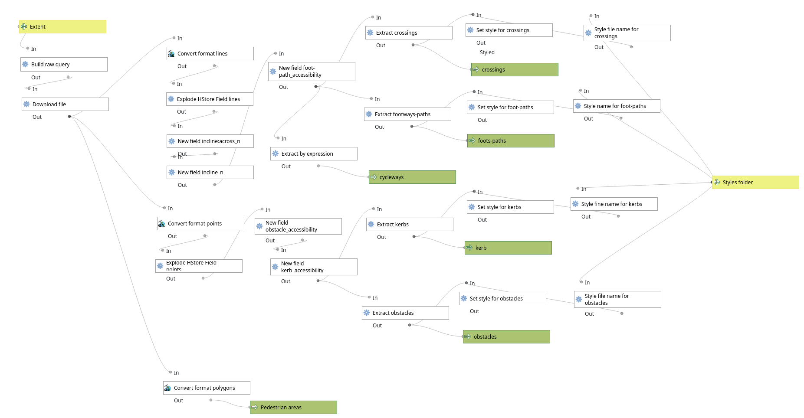
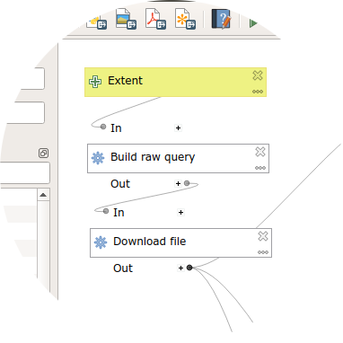
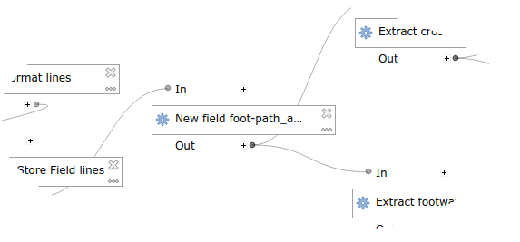

# PEBAmap

Tools to create a map of urban accessibility using OpenStreetMap data and QGIS.


_Fig. 1: Screenshot of the QGIS interface with modules in use._

## Objective

The purpuse is to provide users with a workflow to:
* query and extract from OpenstreetMap features related to footpaths;
* apply some algorithms to classify features in relation to accessibility for disabled people;
* apply symbols and styles;
* create a map of urban accessibility.

## Content of the repository

This repository contains:
* one QGIS project ([OSMaccessibility.qgz](OSMaccessibility.qgz)) to be used to test the tools
* 2 QGIS processing models to extract and style elements related to footpaths ([accessibility_footpaths.model3](accessibility_footpaths.model3)) and parking spaces for disable people ([parking_disabled.model3](parking_disabled.model3)).
* a folder ([styles](styles)) containing some .qml files and a few symbols for styiling features in QGIS.

## QGIS processing modules

Some of the steps and blocks used in these models are directly inspired by the _osm_download_style.model3_ example provided in the QuickOSM QGIS plugin github repository: https://github.com/3liz/QuickOSM/tree/master/resources/model

### Accessibility of footways and paths


_Fig. 2: Overview of the accessibility_footpaths module._


This module ([accessibility_footpaths.model3](accessibility_footpaths.model3)) performs the following main steps:
1. downloads footpaths and pedestrian areas from OpenStreetMap;
2. creates 3 layers: one for each geometric primitive: points, lines, polygons;
3. adds new columns containing a classification of accessibility based on combination of OSM tags;
4. extracts selected features, namely crossings and footpaths from linear features and kerbs and obstacles from point features;
5. uploads the 5 correspondent layers to the QGIS interface;
6. applies specific styles to the layers.

For each of the steps, some more details are described in the following sections.

#### 1. Download data from OpenStreetMap



The block _Build raw query_ uses a functionality of the QGIS [_QuickOSM plugin_](https://github.com/3liz/QuickOSM) to query the OSM database through [Overpass API](https://wiki.openstreetmap.org/wiki/Overpass_API) and to extract only a subset of selected information:
* footways
* paths
* pedestrian areas
* parking spaces for disabled people

The query corresponds to the following Overpass XML:
```XML
<osm-script output="xml" timeout="25">
    <union>
        <query type="node">
            <has-kv k="amenity" v="parking_space"/>
            <has-kv k="disabled" v=""/>
            <bbox-query {{bbox}}/>
        </query>
        <query type="way">
            <has-kv k="amenity" v="parking_space"/>
            <has-kv k="disabled" v=""/>
            <bbox-query {{bbox}}/>
        </query>
        <query type="node">
            <has-kv k="parking_space" v="disabled"/>
             <bbox-query {{bbox}}/>
       </query>
        <query type="way">
            <has-kv k="parking_space" v="disabled"/>
             <bbox-query {{bbox}}/>
       </query>
        <query type="node">
            <has-kv k="amenity" v="parking_space"/>
            <has-kv k="access:disabled" v=""/>
             <bbox-query {{bbox}}/>
       </query>
        <query into="_" type="way">
            <has-kv k="amenity" v="parking_space"/>
            <has-kv k="access:disabled" v=""/>
             <bbox-query {{bbox}}/>
       </query>
        <query type="way">
            <has-kv k="highway" regv="footway|cycleway|path|pedestrian"/>
            <bbox-query {{bbox}}/>
        </query>
    </union>
    <union>
        <item/>
        <recurse type="down"/>
    </union>
    <print mode="body"/>
</osm-script>
```

#### 2. Creates point, lines and polygons layers


This step converts the downloaded OSM data into points, lines and polygons features, through the GDAL library [_Convert format_ algorithm](https://documentation.qgis.org/3.4/en/docs/user_manual/processing_algs/gdal/vectorconversion.html?t#convert-format). This is done querying the data using SQL inside the GDAL module block:
* for points: `-t_srs EPSG:3857`
* for lines: `-sql "select * from lines" -t_srs EPSG:3857`
* for polygons: `-sql "select * from multipolygons" -t_srs EPSG:3857`

Unlikely, the resulting vector layer attribute table contains many OSM tags aggregated in a single field called _other_tags_, making impossible to easily extract information from it during the subsequent steps.

For this reason, an additional sub-step is required, splitting the information contained in the _other_tags_ column in separate ones. This is done through the _Explore HStore Field_ algorithm (not very much documented, I've found this page from PostgreSQL documentation: https://www.postgresql.org/docs/12/hstore.html).

#### 3. Add new columns with accessibility classification



One of the main purposes of the [tagging scheme](https://wiki.openstreetmap.org/wiki/PEBA_Comune_di_Padova#Elementi_da_mappare_e_tag_suggeriti) used for the PEBA of Padua was to be as quantitatively as possible, i.e. using specific tags (width, incline, ...) instead of assign the qualitative _wheelchair=yes/limited/no_ tag.

For this reason, the accessibility evaluation of the features is considered adding some new columns to the attribute tables, containing accessibility values (_not accessible/limited accessibility/good accessibilit_) computed using the [_Field calculator_ algorithm](https://docs.qgis.org/3.4/en/docs/user_manual/processing_algs/qgis/vectortable.html#field-calculator).

In particular, the following formulas are used:
* for **footpaths**
```
CASE
WHEN "width" <> '' AND "width" < '0.9' THEN 'not accessible'
WHEN "smoothness"='very_bad' THEN 'not accessible'
WHEN "highway"='steps' THEN 'not accessible'
WHEN "wheelchair"='no' THEN 'not accessible'
WHEN "crossing"='traffic_signals' AND "traffic_signal:sound" = 'no' THEN 'not accessible'
WHEN "crossing"='unmarked' THEN 'limited accessibility'
WHEN "highway"='path' AND "segregated"='no' THEN 'limited accessibility'
WHEN "incline_n" > 8 OR "incline:across_n" > 1 OR "height" > 0.15 OR "smoothness" = 'intermediate' OR "smoothness" = 'bad' THEN 'limited accessibility'
WHEN "smoothness" = 'good' THEN 'good accessibility'
END
```
* for **kerbs**
```
CASE
WHEN "kerb"='' THEN ''
WHEN "kerb"='raised' OR "kerb:height" > '0.02' OR ("incline" <> 'yes' AND "incline" > 15) THEN 'not accessible'
WHEN "kerb"='rolled' THEN 'limited accessibility'
WHEN ("kerb"='flush' OR "kerb:height" <= '0.01') AND "tactile_paving" = 'yes' THEN 'good accessibility'
ELSE 'limited accessibility'
END
```
* for **obstacles**
```
CASE
WHEN "maxwidth:physical" <> '' AND "maxwidth:physical" < '0.9' THEN 'not accessible'
WHEN "width" <> '' AND "width" < '0.9' THEN 'not accessibile'
WHEN "wheelchair"='no' OR "obstacle:wheelchair"='yes' THEN 'not accessibile'
WHEN "obstacle:blind"='yes' OR "obstacle:blind"='limited' OR "obstacle:foot"='limited' THEN 'limited accessibility'
WHEN "obstacle:wheelchair"='limited' OR "wheelchair"='limited' THEN 'limited accessibility'
ELSE ''
END
```

#### 4-5. Extract and upload features in qgis


Then features are extracted and then loaded separately in the QGIS interface to represent footpaths, crossings, kerbs and obstacles.

The following expression are used:
* for **crossings**: `"footway" = 'crossing' OR "path" = 'crossing'`
* for **footpaths**: `( "highway"  = 'footway' AND ("footway" IS NOT 'crossing')) OR ( "highway"  = 'path' AND ("path" IS NOT 'crossing'))`
* for **kerbs**: `"kerb" <> ''`
* for **obstacles**: `"obstacle:wheelchair" = 'yes' OR "obstacle:wheelchair" = 'limited' OR "maxwidth:physical" <> ''`

#### 6. Style layers


Finally, some styles are applied to the layers, using the following .qml QGIS style files:
* for **crossings**: [crossings.qml](./styles/crossings.qml)
* for **footpaths**: [foot-path.qml](./styles/foot-path.qml)
* for **kerbs**: [kerbs.qml](./styles/kerbs.qml)
* for **obstacles**: [obstacles.qml](./styles/obstacles.qml)

## Background information

During 2019, the local administration of [Padua](https://en.wikipedia.org/wiki/Padua) promoted and funded a work to the release of the local PEBA - Plan for the Elimination of Architectural Barriers (_Piano per l'Eliminazione delle Barriere Architettoniche_ in italian), with the aim to improve the accessibility of urban spaces (footpaths, sidewalks, ...) and public buildings to all people, with a special focus to disabled people.

Two other local administrations ([Fossò](https://it.wikipedia.org/wiki/Foss%C3%B2) and [Rubano](https://it.wikipedia.org/wiki/Rubano)), during 2023, have used the same approach and data process for their PEBA, with some minor custom adaptations to take into consideration local specificities.

## Links and references

* the final plan, comprising textual documentation and cartographic outputs, can be accessed here (only in italian): http://www.padovanet.it/peba
* temporary OSM tagging sheme (in Italian): https://wiki.openstreetmap.org/wiki/PEBA_Comune_di_Padova#Elementi_da_mappare_e_tag_suggeriti
* dinamic and updated map of parking spaces for disabled people: http://umap.openstreetmap.fr/en/map/mappatura-peba-padova_324435
* poster "Planning urban accessibility with OpenStreetMap" presented at the [conference "State Of The Map 2019"](https://2019.stateofthemap.org/), in Heidelberg :
https://doi.org/10.5281/zenodo.3370705
